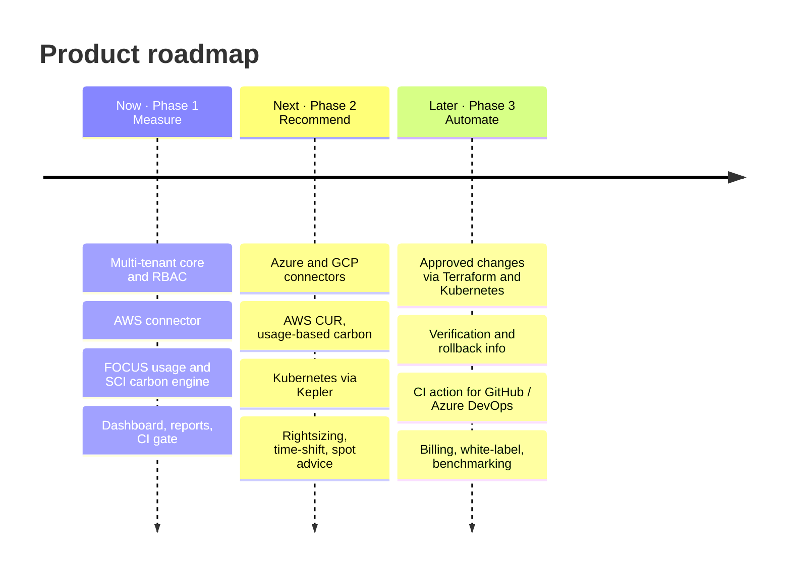

<div align="center">

# 🌱 Reliabilix GreenOps Platform

**Cloud cost and carbon footprint in one view.**
A multi-tenant FinOps + GreenOps SaaS that turns cloud billing into SCI scores,
actionable recommendations and audit-ready reports.

`Go 1.27` · `PostgreSQL 18` · `Redis + Asynq` · `Next.js 16` · `OpenAPI 3` · `FOCUS v1.4`

</div>

---

## What it does

```
Connect cloud ─▶ Sync billing ─▶ Normalize (FOCUS) ─▶ Carbon engine ─▶ SCI score
                                                          │
                                       Recommendations ◀──┘ ─▶ Human approval ─▶ Apply
```

- **One chart, two lines:** cost and CO₂e side by side, with honest "no data" states.
- **Standards first:** billing is normalized to the FinOps Open Cost and Usage Specification (FOCUS v1.4); carbon follows the Green Software Foundation SCI formula with a versioned methodology.
- **Human in the loop:** recommendations are never applied automatically; approval is role-gated and re-checked against the project's data-residency policy.
- **CI gate:** a PASS / WARN / BLOCK verdict for planned infrastructure changes, callable with a machine API key.

## Architecture in one minute

A **modular monolith**: three processes (`api`, `worker`, `scheduler`) plus an admin CLI, built from one codebase and split by domain.

| Principle | How |
|---|---|
| Domain isolation | 13 modules with identical layers (`domain` / `application` / `repository` / `http`); modules never import each other (enforced by lint), they talk through ports wired in `internal/app` |
| Tenant isolation | explicit tenant argument in every query **and** PostgreSQL Row Level Security; runtime DB roles cannot bypass it |
| Identity | Auth0 (OIDC) proves who you are; tenant and role come from the database, never from the token |
| Async by default | sync → ingest → carbon → recommendations is a chain of Asynq jobs, no event bus |
| Contract first | `backend/api/openapi.yaml` is checked against the routes by a test; frontend types are generated from it |

Decisions are recorded in [`docs/adr/`](docs/adr/). Security model: [`docs/security/model.md`](docs/security/model.md).

```
backend/    Go: cmd/{api,worker,scheduler,admin}, internal/{platform,<domains>,app}, migrations/, api/openapi.yaml, tests/
frontend/   Next.js 16 · React 19 · TypeScript · Tailwind · TanStack Query · Zustand · ECharts
deploy/     docker/, aws/ (IAM templates), observability/ (Prometheus, Grafana, Tempo, Loki), dev/ (seeds)
docs/       setup/, architecture/, security/, api/, adr/
```

## Quick start

```bash
docker compose up --build        # postgres, redis, migrations, api, worker, scheduler, web
open http://localhost:3000       # dev login, no Auth0 needed (ENV=dev)
```

The dev tenant starts empty on purpose. To see a populated dashboard:

```bash
make seed-demo     # clearly labelled demo rows in the database (the frontend has no mock data)
make recalc        # runs the real carbon engine and recommendations on them
```

Without Docker: `docker compose up -d postgres redis && make migrate && make seed && make run-api`, then `make web`.

## Everyday commands

| Command | Purpose |
|---|---|
| `make test` | unit tests, including the OpenAPI ↔ routes parity test |
| `make test-integration` | real PostgreSQL + Redis: RLS on every tenant table, role privileges, the end-to-end pipeline |
| `make lint` / `make vuln` | gosec + module-isolation rules / govulncheck |
| `make sqlc` / `make api-types` | regenerate repositories / frontend API types (CI fails on drift) |
| `make doctor` | verify every configured external integration |
| `make smoke` | end-to-end check against a running stack |

## Connecting external services

Step-by-step guide: [`docs/setup/README.md`](docs/setup/README.md) (database, Redis, Auth0, AWS, grid carbon data, object storage, observability). Run `make doctor` after each step.

## Roadmap

> **Measure → Recommend → Automate.** Each phase builds on the previous one without reworking the foundation.



| Phase | Theme | Status | Highlights |
|---|---|---|---|
| **1 · Measure** | See cost and carbon together | ✅ backend done · 🚧 frontend | Multi-tenant core, RLS isolation, AWS connector, FOCUS v1.4 usage, SCI engine, region-shift advice with approval, reports, CI gate |
| **2 · Recommend** | Wider coverage, smarter advice | 🗓️ planned | Azure, GCP, AWS CUR, Kubernetes (Kepler), WattTime, rightsizing / time-shift / spot, scheduled reports, e-mail delivery, SCI self-certification assistant |
| **3 · Automate** | Controlled change execution | 🗓️ planned | Automation jobs with risk analysis, Terraform / Kubernetes executors, reusable CI action, Stripe billing, white-label, benchmarking |

**Guiding rules**

1. **No guessing:** missing data is shown as missing; estimates carry their method and confidence.
2. **Nothing changes production without a human decision** and an audit record.
3. **Security by construction:** isolation in the database, customer secrets never stored, least privilege everywhere.
4. **Extract a service only when a measured trigger fires** ([ADR-0005](docs/adr/0005-service-extraction-triggers.md)).

Detailed checklist: [`ROADMAP.md`](ROADMAP.md).

## Honest status

- Carbon is **usage-based** for EC2 running hours and S3 storage (from Cost Explorer quantities) and **cost-based** for everything else, with **provisional** coefficients (methodology `CCF-2026.1`); resource-level accounting arrives with CUR ingestion.
- The AWS connector, Auth0, object storage and the Docker stack are covered by fakes and integration tests but have not yet been exercised against live services.
